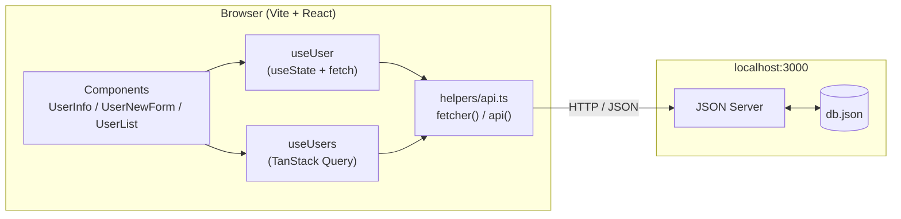
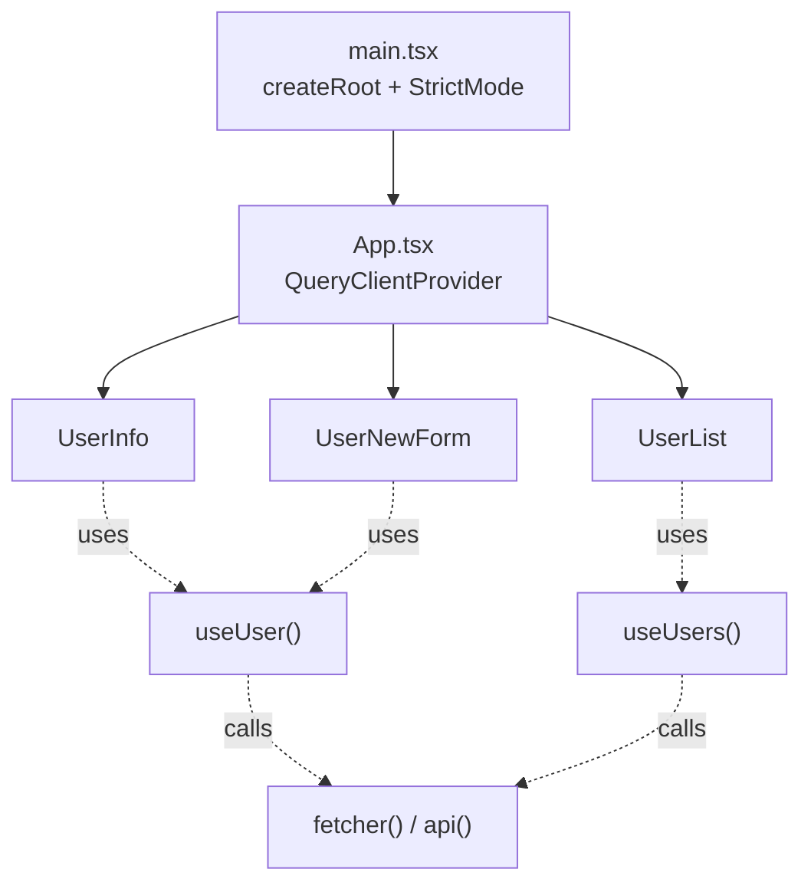
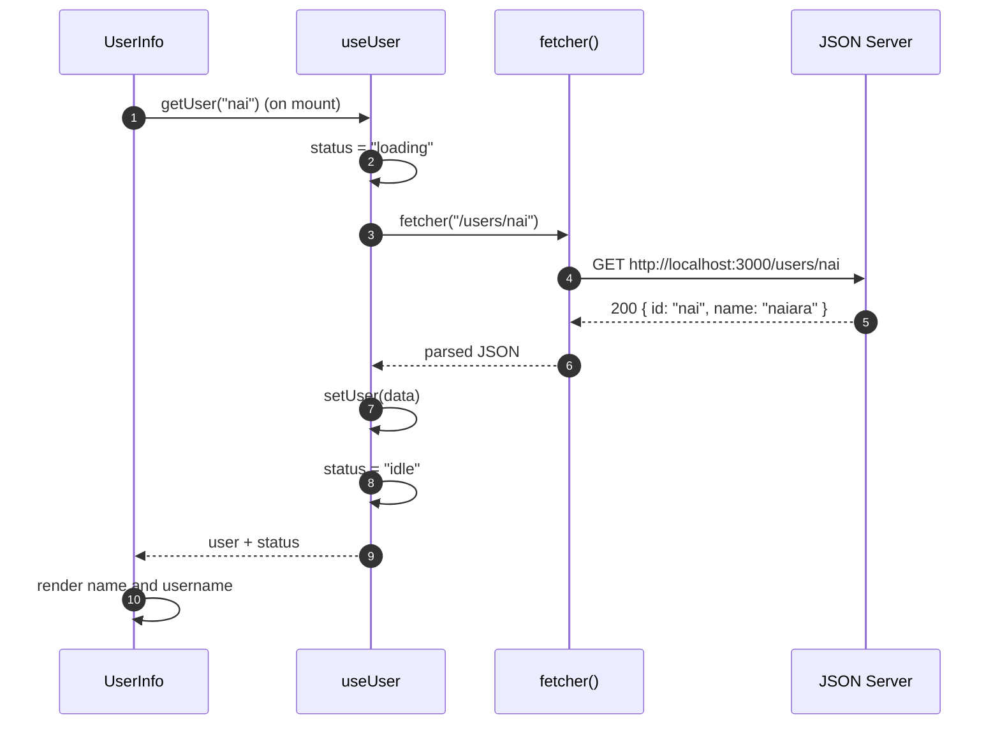
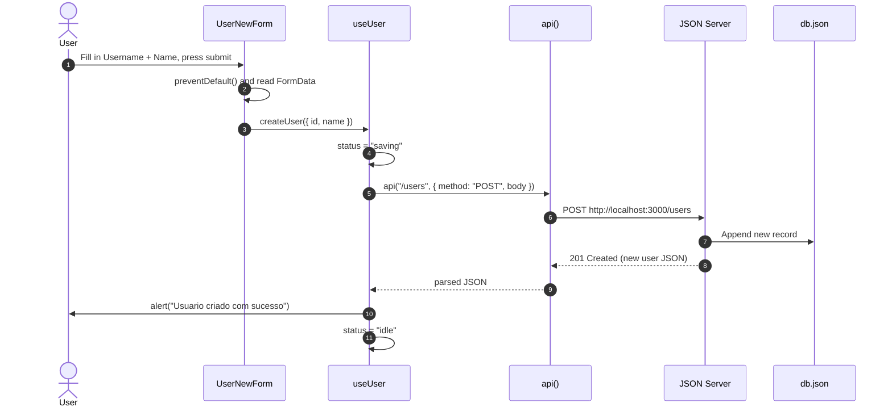
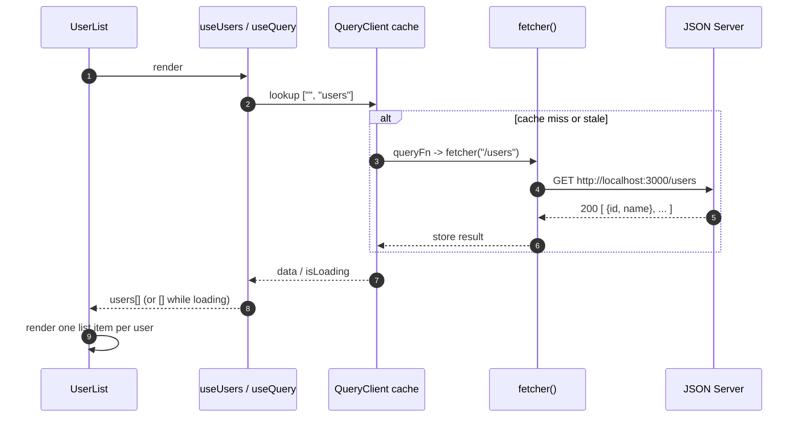
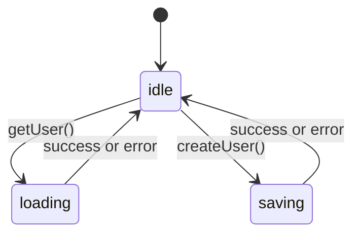
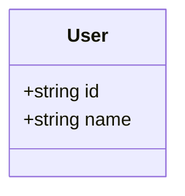

# Requests

A small React + TypeScript front end that demonstrates how to talk to a REST API. It fetches a single user, lists all users and creates new ones, using a local [JSON Server](https://github.com/typicode/json-server) as the back end.

The project is deliberately compact, which makes it a good reference for two common data-fetching approaches side by side:

- a **custom hook** built on `useState` and `fetch` (single user and user creation);
- **TanStack Query** (`useQuery`) for cached, declarative reads (user list).

---

## Table of contents

- [What it does](#what-it-does)
- [Tech stack](#tech-stack)
- [Getting started](#getting-started)
- [Project structure](#project-structure)
- [How it works](#how-it-works)
  - [Architecture overview](#architecture-overview)
  - [Component tree](#component-tree)
  - [Fetching a single user](#fetching-a-single-user)
  - [Creating a user](#creating-a-user)
  - [Listing all users](#listing-all-users)
  - [Request status state machine](#request-status-state-machine)
- [Data model](#data-model)
- [API endpoints used](#api-endpoints-used)
- [Known limitations](#known-limitations)
- [Scripts](#scripts)

---

## What it does

The single page is split into three sections:

| Section | Component | Behaviour |
| --- | --- | --- |
| User details | `UserInfo` | On load, fetches the user with the username `nai` and shows their name and username (ID). |
| New user form | `UserNewForm` | Submits a new user (`id` and `name`) to the API with a `POST` request. |
| User list | `UserList` | Fetches and displays every user held in the database. |

## Tech stack

- [React 19](https://react.dev/) with the React Compiler enabled
- [TypeScript](https://www.typescriptlang.org/)
- [Vite](https://vite.dev/) as the build tool and dev server
- [TanStack Query v5](https://tanstack.com/query) for server-state management
- [JSON Server](https://github.com/typicode/json-server) as a fake REST API (data stored in `db.json`)
- ESLint with the React Hooks and React Refresh plugins
- pnpm as the package manager

## Getting started

### Prerequisites

- Node.js (a current LTS release or newer)
- pnpm

### Installation

```bash
git clone https://github.com/Martinezkill/requests.git
cd requests
pnpm install
```

### Running the project

You need **two terminals**: one for the API and one for the front end.

```bash
# Terminal 1 - start the fake API (serves db.json on http://localhost:3000)
npx json-server db.json

# Terminal 2 - start the Vite dev server
pnpm dev
```

Then open the URL printed by Vite (usually `http://localhost:5173`).

> The front end expects the API at `http://localhost:3000`. This is hard-coded in `src/helpers/api.ts`.

## Project structure

```text
requests/
├── db.json                     # JSON Server database (users collection)
├── index.html                  # Vite HTML entry point
├── vite.config.ts              # Vite + React + React Compiler config
├── readme.ts                   # Quick notes on how to start the project
└── src/
    ├── main.tsx                # React entry point
    ├── App.tsx                 # QueryClientProvider + page layout
    ├── helpers/
    │   └── api.ts              # fetcher (GET) and api (any method) wrappers
    ├── hooks/
    │   └── use-user.ts         # Custom hook: get one user / create a user
    ├── components/
    │   ├── user-info.tsx       # Shows a single user
    │   └── user-new-form.tsx   # Form to create a user
    └── models/
        ├── user.ts             # User interface
        ├── use-users.ts        # TanStack Query hook: list users
        └── user-list.tsx       # Renders the list of users
```

## How it works

### Architecture overview

The UI never calls `fetch` directly. Components rely on hooks, and hooks rely on two small HTTP helpers, which in turn talk to JSON Server.



### Component tree

`App` wraps everything in a `QueryClientProvider`, which is what allows `UserList` to use `useQuery`.



### Fetching a single user

`UserInfo` calls `getUser("nai")` inside a `useEffect` when it mounts. The hook tracks the request status so the component can show a loading message.



If the request throws, the error is logged and the user sees an `alert("Erro ao buscar o usuario")`. The status is always reset to `idle` in the `finally` block.

### Creating a user

The form reads its values with `FormData`, builds a `User` payload and hands it to `createUser`.



While the status is `saving`, the submit button label changes to `criando...`.

### Listing all users

`useUsers` wraps TanStack Query. The query is cached by the `QueryClient`, and the component only needs to react to `isLoading`.



### Request status state machine

The `useUser` hook models its request state as one of three values.



## Data model



`id` doubles as the username and is used as the resource key (`/users/:id`). Example from `db.json`:

```json
{
  "users": [
    { "id": "vi", "name": "vitoria" },
    { "id": "gus", "name": "gustavo" },
    { "id": "nai", "name": "naiara" }
  ]
}
```

## API endpoints used

All requests go to `http://localhost:3000`.

| Method | Endpoint | Used by | Purpose |
| --- | --- | --- | --- |
| `GET` | `/users` | `useUsers` | List every user |
| `GET` | `/users/:id` | `useUser.getUser` | Fetch one user |
| `POST` | `/users` | `useUser.createUser` | Create a user |

## Known limitations

This is a learning project, so a few things are intentionally simple:

- The API base URL is hard-coded rather than read from an environment variable.
- The `POST` request does not set a `Content-Type: application/json` header. Depending on the JSON Server version, this may need adding for the body to be parsed.
- After a user is created, the list is not refreshed automatically. Invalidating the `["", "users"]` query (or using `useMutation`) would fix that.
- `UserInfo` always loads the hard-coded username `nai`.
- Errors are reported with `alert()` rather than in-page messages.
- Interface text is in Portuguese.

## Scripts

| Command | Description |
| --- | --- |
| `pnpm dev` | Start the Vite dev server with hot module replacement |
| `pnpm build` | Type-check with `tsc -b` and build for production |
| `pnpm preview` | Preview the production build locally |
| `pnpm lint` | Run ESLint across the project |
| `npx json-server db.json` | Start the fake API on port 3000 |
